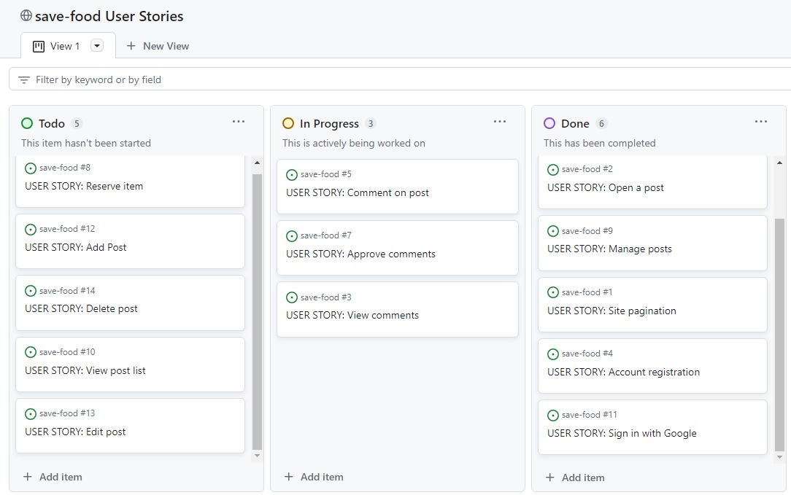
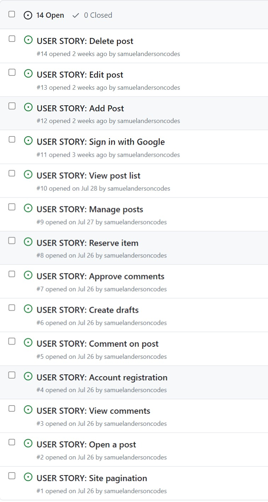

# Save Food

Save Food is a web application pilot project that provides the platform for people to share food instead of throwing them away or leaving them to spoil. On the other hand, poeple are also able to view the posted food items and chat their owners for the food to be reserved and picked up at the given location.

The live link can be found here: [Live Site - Save Food](https://save-food-3b2a71b51608.herokuapp.com/)

## Table of Contents
- [Save Food](#save-food)
  - [Table of Contents](#table-of-contents)
- [User-Experience-Design](#user-experience-design)
  - [The-Strategy-Plane](#the-strategy-plane)
    - [Site-Goals](#site-goals)
    - [Agile Planning](#agile-planning)
      - [Epics](#epics)
      - [User Stories](#user-stories)
  - [The-Scope-Plane](#the-scope-plane)
  - [The-Structure-Plane](#the-structure-plane)
    - [Features](#features)
    - [Features Left To Implement](#features-left-to-implement)
  - [The-Skeleton-Plane](#the-skeleton-plane)
    - [Wireframes](#wireframes)
    - [Database-Design](#database-design)
    - [Security](#security)
  - [The-Surface-Plane](#the-surface-plane)
    - [Design](#design)
    - [Colour-Scheme](#colour-scheme)
    - [Typography](#typography)
    - [Imagery](#imagery)
  - [Technolgies](#technolgies)
  - [Testing](#testing)
  - [Deployment](#deployment)
    - [Version Control](#version-control)
    - [Heroku Deployment](#heroku-deployment)
  - [Credits](#credits)

# User-Experience-Design

## The-Strategy-Plane

### Site-Goals

The site is aimed at providing a platform for people to share food. Registered users are able to chat owners of the posted food items and through that confirm their reservation and later pick it up at the given location. 
Owners of food item posts are able to edit, delete and have a reserved status on their posts when necessary.

This is to help in reducing food wastage and greenhouse gas emmision as well as saving natural resources and the planet. In the end people get fed and it is a happier society.

### Agile Planning

This project was developed using agile methodologies by delivering small features in incremental sprints. There were 3 sprints in total, spaced out evenly over four and half weeks.

All projects were assigned to epics, prioritized chronologically as, Must have, should have and could haves. They were assigned to sprints and stories based on their level of complexity. Implementation was done in order of the aforementioned priority. It was done this way to ensure that all core requirements were completed first to give the project a complete feel, with the nice to have features being added should there be the capacity.

The Kanban board was created using github projects and can be located [here](https://github.com/users/samuelandersoncodes/projects/1) and can be viewed to see more information on the project cards. All stories except the documentation tasks have a full set of acceptance criteria in order to define the functionality that marks that story as complete.

### Save Food issues

#### Epics

The project had 6 main Epics (milestones):

**EPIC 1 - Base Setup**

The base setup epic is for all stories needed for the base set up of the application. Without the base setup, the app would not be possible so it was the first epic to be delivered as all other features depend on the its completion.

**EPIC 2 - Stand alone Pages**

The stand alone pages epic is for small pages that did not have enough stories to warrant their own full epics. Instead of creating epics for tiny features, these small deliverables were all added under this epic.

**EPIC 3 - Authentication Epic**

The authentication epic is for all stories related to the registration, login and authorization of views. This epic provides critical functionality and value as without it users would not be able to securely post and edit food items as well as chat item owners for food reservation.

**EPIC 4 - Food item posts Epic**

The item posts epic is for all stories that relate to creating, viewing, updating and deleting food item posts. This allows logged in users who are owners of respective posts to easily edit and delete posts when necessary and also reserve food items for users who really need them. Through this epic, all other users are able to post and view other food item posts.

**EPIC 5 - Deployment Epic**

This epic is for all stories related to deploying the app to heroku so that the site is live for users.

**EPIC 6 - Documentation**

This epic is for all document related stories and tasks that are needed to document the software development lifecycle of the application. It aims to deliver quality documentation, explaining all stages of development and necessary information on running, deploying and using the application.

#### User Stories

The following user stories (by epic) were completed over the 3 sprints:

**EPIC 1 - Base Setup**

As a developer, I need to create the base.html page and structure so that other pages can reuse the layout

As a developer, I need to create static resources so that images, css and javascript work on the website

As a developer, I need to set up the project so that it is ready for implementing the core features

As a developer, I need to create the footer with social media links

As a developer, I need to create the navbar so that users can navigate the website from all spheres of devices

**EPIC 2 - Stand alone Pages**

As a developer, I need to implement a 404 error page to alert users when they have accessed a page that doesn't exist

As a developer, I need to implement a 500 error page to alert users when an internal server error occurs

As a developer, I need to implement a 403 error page to redirect unauthorised users so that I can secure my views

As a site owner, I need a home page so that users can view food item posts

As a site owner, I need a post detail page so that users can view the details of food items and chat the respective owners for reservation

As a site owner, I need an about page so that users can know more about the site

**EPIC 3 - Authentication Epic**

As a developer, I need to implement allauth so that users can sign up and have access to the websites features

As a Site Owner, I want users to easily sign in with google so that site access and use is not complicated.

As a site owner, I would like the allauth pages customized so that they match with the sites styling

**EPIC 4 - Food item posts**

As a user, I would like to be able to share a food item so that others can view and come for it

As a user, I would like to view food item posts so that I can choose the needed food item

As a user, I would like to be able to edit a my own food item post so that I can make changes when needed

As a user, I would like to be notified when I make a post, edit or delete one so that I know it was added, updated nor deleted successfully

As a user I would like to delete my own food item post when it is picked up or no longer available so that it is not a nuisance

As a user I would like chat or comment on posts I am interested in so that I will be reserved for me and I will know when to pick it up

**EPIC 5 - Deployment Epic**

As a developer, I need to set up whitenoise so that my static files are served in deployment

As a developer, I need to deploy the project to heroku so that it is live for users

**EPIC 6 - Documentation**

Tasks:

* Complete readme documentation

## The-Scope-Plane

* Responsive Design - Site should be fully functional on all devices above 320px
* Hamburger menu for mobile devices
* Ability to perform CRUD functionality on food item posts
* Restricted role based features
* Home page with site information

## The-Structure-Plane

### Features

``USER STORY - As a developer, I need to create the navbar so that users can navigate the website from all sizes of devices``

Implementation:

**Navigation Menu**

 The Navigation contains links for Home, About and has allauth options for login, signup and logout.

 The following navigation items are available on all pages:
  * Home -> index.html - Visible to all
  * About -> about.html - Visible to all
  * Login -> login.html - Visible to logged out users
  * signup -> signup.html - Visible to logged out users
  * Logout -> logout.html - Visible to logged in users

  The navigation menu is displayed on all pages and pops out into a hamburger menu on smaller devices. This will allow users to view the site from any device without taking up too much space on mobile devices.

  