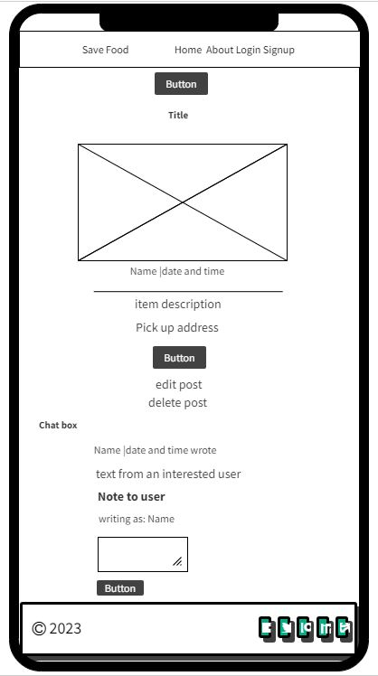
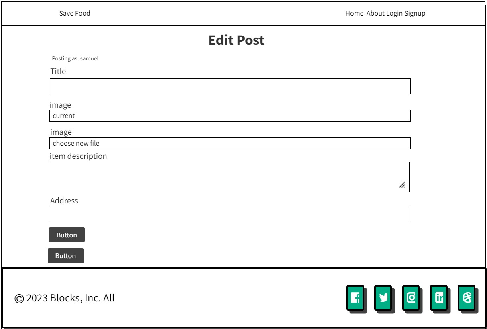

# Save Food

Save Food is a web application pilot project that provides the platform for people to share food instead of throwing them away or leaving them to spoil. On the other hand, poeple are also able to view the posted food items and chat their owners for the food to be reserved and picked up at the given location.

The live link can be found here: [Live Site - Save Food](https://save-food-3b2a71b51608.herokuapp.com/)

## Table of Contents
- [Save Food](#save-food)
  - [Table of Contents](#table-of-contents)
- [User-Experience-Design](#user-experience-design)
  - [The-Strategy-Plane](#the-strategy-plane)
    - [Site-Goals](#site-goals)
    - [Agile Planning](#agile-planning)
      - [Epics](#epics)
      - [User Stories](#user-stories)
  - [The-Scope-Plane](#the-scope-plane)
  - [The-Structure-Plane](#the-structure-plane)
    - [Features](#features)
    - [Features Left To Implement](#features-left-to-implement)
  - [The-Skeleton-Plane](#the-skeleton-plane)
    - [Wireframes](#wireframes)
    - [Database-Design](#database-design)
    - [Security](#security)
  - [The-Surface-Plane](#the-surface-plane)
    - [Design](#design)
    - [Colour-Scheme](#colour-scheme)
    - [Typography](#typography)
    - [Imagery](#imagery)
  - [Technolgies](#technolgies)
  - [Testing](#testing)
  - [Deployment](#deployment)
    - [Version Control](#version-control)
    - [Heroku Deployment](#heroku-deployment)
  - [Credits](#credits)

# User-Experience-Design

## The-Strategy-Plane

### Site-Goals

The site is aimed at providing a platform for people to share food. Registered users are able to chat owners of the posted food items and through that confirm their reservation and later pick it up at the given location. 
Owners of food item posts are able to edit, delete and have a reserved status on their posts when necessary.

This is to help in reducing food wastage and greenhouse gas emmision as well as saving natural resources and the planet. In the end people get fed and it is a happier society.

### Agile Planning

This project was developed using agile methodologies by delivering small features in incremental sprints. There were 3 sprints in total, spaced out evenly over four and half weeks.

All projects were assigned to epics, prioritized chronologically as, Must have, should have and could haves. They were assigned to sprints and stories based on their level of complexity. Implementation was done in order of the aforementioned priority. It was done this way to ensure that all core requirements were completed first to give the project a complete feel, with the nice to have features being added should there be the capacity.

The Kanban board was created using github projects and can be located [here](https://github.com/users/samuelandersoncodes/projects/1) and can be viewed to see more information on the project cards. All stories except the documentation tasks have a full set of acceptance criteria in order to define the functionality that marks that story as complete.

### Save Food issues

#### Epics

The project had 6 main Epics (milestones):

**EPIC 1 - Base Setup**

The base setup epic is for all stories needed for the base set up of the application. Without the base setup, the app would not be possible so it was the first epic to be delivered as all other features depend on the its completion.

**EPIC 2 - Stand alone Pages**

The stand alone pages epic is for small pages that did not have enough stories to warrant their own full epics. Instead of creating epics for tiny features, these small deliverables were all added under this epic.

**EPIC 3 - Authentication Epic**

The authentication epic is for all stories related to the registration, login and authorization of views. This epic provides critical functionality and value as without it users would not be able to securely post and edit food items as well as chat item owners for food reservation.

**EPIC 4 - Food item posts Epic**

The item posts epic is for all stories that relate to creating, viewing, updating and deleting food item posts. This allows logged in users who are owners of respective posts to easily edit and delete posts when necessary and also reserve food items for users who really need them. Through this epic, all other users are able to post and view other food item posts.

**EPIC 5 - Deployment Epic**

This epic is for all stories related to deploying the app to heroku so that the site is live for users.

**EPIC 6 - Documentation**

This epic is for all document related stories and tasks that are needed to document the software development lifecycle of the application. It aims to deliver quality documentation, explaining all stages of development and necessary information on running, deploying and using the application.

#### User Stories

The following user stories (by epic) were completed over the 3 sprints:

**EPIC 1 - Base Setup**

As a developer, I need to create the base.html page and structure so that other pages can reuse the layout

As a developer, I need to create static resources so that images, css and javascript work on the website

As a developer, I need to set up the project so that it is ready for implementing the core features

As a developer, I need to create the footer with social media links

As a developer, I need to create a logo so that users can easily identify the site by it as a brand

As a developer, I need to create the navbar so that users can navigate the website from all spheres of devices

**EPIC 2 - Stand alone Pages**

As a developer, I need to implement a 404 error page to alert users when they have accessed a page that doesn't exist

As a developer, I need to implement a 500 error page to alert users when an internal server error occurs

As a developer, I need to implement a 403 error page to redirect unauthorised users so that I can secure my views

As a site owner, I need a home page so that users can view food item posts

As a site owner, I need a post detail page so that users can view the details of food items and chat the respective owners for reservation

As a site owner, I need an about page so that users can know more about the site

**EPIC 3 - Authentication Epic**

As a developer, I need to implement allauth so that users can sign up and have access to the websites features

As a Site Owner, I want users to easily sign in with google so that site access and use is not complicated.

As a site owner, I would like the allauth pages customized so that they match with the sites styling

**EPIC 4 - Food item posts**

As a user, I would like to be able to share a food item so that others can view and come for it

As a user, I would like to view food item posts so that I can choose the needed food item

As a user, I would like to be able to edit a my own food item post so that I can make changes when needed

As a user, I would like to be notified when I make a post, edit or delete one so that I know it was added, updated or deleted successfully

As a user I would like to delete my own food item post when it is picked up or no longer available so that it is not a nuisance

As a user I would like to chat or comment on posts I am interested in so that it will be reserved for me and I will know when to pick it up

**EPIC 5 - Deployment Epic**

As a developer, I need to set up whitenoise so that my static files are served in deployment

As a developer, I need to deploy the project to heroku so that it is live for users

**EPIC 6 - Documentation**

Tasks:

* Complete readme documentation

## The-Scope-Plane

* Responsive Design - Site should be fully functional on all devices above 320px
* Hamburger menu for mobile devices
* Ability to perform CRUD functionality on food item posts
* Restricted role based features
* Home page with site information

## The-Structure-Plane

### Features

``USER STORY - As a developer, I need to create a logo so that users can easily identify the site by it as a brand``

Implementation:

**Logo**

A logo has been added to the top left corner of the site which is seen on all site pages. This helps users to easily identify the site.

``USER STORY - As a developer, I need to create the navbar so that users can navigate the website from all sizes of devices``

Implementation:

**Navigation Menu**

 The Navigation contains links for Home, About and has allauth options for login, signup and logout.

 The following navigation items are available on all pages:
  * Home -> index.html - Visible to all
  * About -> about.html - Visible to all
  * Login -> login.html - Visible to logged out users
  * signup -> signup.html - Visible to logged out users
  * Logout -> logout.html - Visible to logged in users

  The navigation menu is displayed on all pages and pops out into a hamburger menu on smaller devices. This will allow users to view the site from any device without taking up too much space on mobile devices.

  

  ``USER STORY - As a site owner, I need a home page so that users can view food item posts``

  Implementation:

**Home Page**

The home page contains a brief information on the top that informs users on the site's purpose. 
When logged in, there is a 'share' button below the information section that allows users to share food items. 
The section below the aforementioned information or the 'share' button when user is logged in makes room for all posted food items.

Each posted food item is found in a card with fields of featured image on top, name of the post owner beneath it, the title and description of the posted item, the pick up location, then comes the date and time of the the post. 

At the bottom of each card is a 'reserve' button that takes the user to the post's detail page to enable the user to chat the post owner for the food item reservation and pick up. 
Only owners of posts can through this button tag their respective posts as reserved which is seen on the post detail page as they are redirected there upon a click. This is to help post owners identify which of their posted items are reserved and also prevent all users from playing with the reserve toggle.

The page takes six posts at a go in pagination. Therefore at the bottom of each sixth post is the 'next' button that takes users to older posts. When users are on older posts, they can easily come back to fresher posts by clicking the 'prev' button.

``As a site owner, I need an about page so that users can know more about the site``

Implementation:

**About Page**

On the top of the About page is a heading that informs the user on the page's purpose. This page is available to all users without restrictions.

The About page contains information on the conception and ideology of the site.

``As a developer, I need to implement allauth so that users can log in and have access to the website's features``

Implementation:

**Log in page**

Upon clicking the log in link anywhere on the site, users are directed to the log in page to log in so that they can be able to get full access to the site's features.

On the top of the page is a heading and text that informs the user on the page's purpose and a welcome information respectively.

Below that is a "Sign in with google" button that enable users to easily sign in with their google accout. This is a time saver feature that quickens a secured access to the site.

Then comes the form for username and password followed by a 'remember me' checkbox. Beneath that is the sign in button that enables users to log in if they are already registered.

``As a developer, I need to implement allauth so that users can sign up and have access to the website's features``

Implementation:

**Sign up page**

Upon clicking the sign up link anywhere on the site, users are directed to the signup page to make a registration in order for them to be able to get full access to the site's features.

On the top of the page is a heading and text that informs the user on the page's purpose and a welcome information respectively.

Below that is a "Sign in with google" that enables users to easily sign in with their google accout. This is a time saver feature that quikens a secured access to the site.

Then comes the form for username, optional email, password and password confirmation fields. Beneath that is the sign up button that enables users to register on the site.

``USER STORY - As a developer, I need to create a footer with social media links so that users can be more informed or communicate with site management``

Implementation:

**Footer**

A footer has been added to the bottom of the site which is seen at the bottom of all site pages, this contains an Instagram, Facebook, Twitter and youtube links so that users can follow the site on social media if they want to keep up to date with site related activities and also communicate with management. These icons have aria-labels added to ensure users with assistive screen reading technology know the purpose of the links. They also open in new tabs for user convenience.

The footer also comes with the site's copyright statement on top of the social media icons.

``As a site owner, I need a post detail page so that users can view the details of food items and chat the respective owners for reservation``

Implementation:

**Post Detail Page**

At the very top of the post detail page is a 'share food' Button that allows users to share food item posts just like that of the home page.

The post detail page has all the details of the posted food item inherited from the home page (fields of title on top, then comes the featured image, name of the post owner and date and time of the the post beneath it, the description of the posted item and the pick up location. At the bottom is the 'reserve' button for only owners of posts.)

In addition, there is a a chat box (on the side of the post's details on large screens and at the bottom on small screens) where logged in users who are interested in picking up food items can through a chat with the owner of the food item reserve the food item. Below the body of the chat text is a submit button that enables the user to send their message after they have written them.

At the top of this chat box is an animated heading in red for logged in users who are not owners of the post. It brings their attention to chat the food item owner for reservation and pick up if they are really serious about getting that food item.

Owners of posts are able to mark their items as reserved through the 'reserve' button. This helps them to know or remember that the item is reserved for someone who will soon pick it up. Owners are encouraged through a heading in the chat box section to reserve food for only seroius users who really need the items. Thus, eliminating the the trend of asking for something but not going for it in the end.

At the bottom of this page is an edit and delete link through which owners of posts can edit and delete their posts when necessary.

``As a user, I would like to be able to share a food item so that others can view and come for it``

Implementation:

**Add Post Page**

Upon clicking on the 'share food' button on the home and postdetail pages, logged in users are taken to the addpost page. Where there is a form to fill in title, featured image, the description of the food item and the pick up location fields. On the top of this form is a heading that tells the purpose of the page 'to post a food item.'

Below the form are two buttons; 'submit' and 'back' buttons that submits the post and takes the user back to the home page respectively.

``As a user, I would like to be able to edit a my own food item post so that I can make changes when needed``

Implementation:

**Edit Post Page**

On the top of this form is a heading that tells the purpose of the page 'to edit the post in question.'

Only owners of posts are able to edit their posts. When a user clicks on the 'edit' link on the home and or postdetail pages, they are directed to the editpost page. Where there is a prepopulated form with their previous post details in the fields of title, featured image, the description of the food item and the pick up location. Here, they are able to make amends and update the post through the 'update' button or return back to the home page through the 'back' button.

``As a user I would like to delete my own food item post when it is picked up or no longer available so that it is not a nuisance``

Implementation:

**Delete Post Page**

On the top of this form is a heading that tells the purpose of the page 'to delete the post in question.'

Only owners of posts are able to delete their posts. When a user clicks on the 'delete' link on the home and or postdetail pages, they are directed to the deletepost page. Where they are asked to confirm the deletion by clicking the 'delete' button or return back to the home page through the 'cancel' button.

``As a user, I would like to be notified when I make a post, edit or delete one so that I know it was added, updated or deleted successfully``

Implementation:

**Notifications**

On each Posting, Updating and Deleting operations, users are notified with a success message to alert and confirm to them on the operation success.

``As a user I would like to chat or comment on posts I am interested in so that it will be reserved for me and I will know when to pick it up``

Implementation:

**Chat Box**

The chat box is located on the side of the post's details page on large screens and at the bottom on small screens. At the top of it is an animated heading in red to attract the attention of logged in users who are not owners of the post in question to chat the food item owner for reservation and pick it up if they are really serious about getting that food item.

Below the body of the chat text is a submit button that enables the user to send their message after they have written them.

After a text is submitted, the user is notified on the success of submission. 

**Error Pages**

``USER STORY - As a developer, I need to implement a 404 error page to alert users when they have accessed a page that does not exist``

Implementation:

**404 Page**

As a developer, I need to implement a 404 error page so that users are redirected there when they try to access a page that is not available to them.

A 404 page has been implemented and will display if a user navigates to a broken link or a page they are not suppose to have access to.

The 404 page will allow the user to easily navigate back to the Home page through the 'back' button

``USER STORY - As a developer, I need to implement a 403 error page to alert users when accessing a page or view that they do not have permission to view``

Implementation:

**403 Page**

A 403 error page has been implemented to provide feedback to the user when they try to access unauthorized content. Users will be directed to this page if they alter the URL's and attempt to edit, delete or access pages that are restricted. 

This covers:

* Edit Post - Only authorized users
* Delete Post - Only authorized users

``USER STORY - As a developer, I need to implement a 500 error page to alert users when an internal server error occurs``

Implementation:

**500 Page**

A 500 error page has been implemented to alert users when an internal server error occurs.

### Features Left To Implement
- In a future release I would like to implement a search filter that will help users to quickly find a food item by location, food category and posted time and date. This will save them time as compared to a manual search.
- The address section will also make use of django's AddressField. This will make it easier for users to input their addresses for food item pick ups.
- Users will also be able to sign in with facebook and instagram so as to foster a faster and more convenient site registration.

## The-Skeleton-Plane

### Wireframes

- Home page

- Post detail page

- About page

- Signup page

- Login page

- Logout page

- Add post page

- Edit post page

- 403 error page

- 404 error page

- 500 error page

### Database-Design

The database was designed to allow CRUD functionality to be available to registered users, when signed in. The post model is at the heart of the application as it is connected to the sharing, editing, deleting and commenting on posted items. It is linked by primary/foreign key relationships.

The Comment model is tied to the post model through the post model's foreign key. This allows for users to leave messages for item owners and make them reserve food items for pick ups.

Postings are related to the author (user) by a Foreign Key which allows the users to be able to view, update delete posts attached to their accounts.

The entity relationship diagram below shows the schemas for each of the models and how they are related.

### Security

Views were secured by using the django class based view mixin, UserPassesTextMixin. A test function was created to use the mixin and checks were ran to ensure that the user who is trying to access the page is authorized. Any staff restricted functionality, user edit/delete functionality listed in the features was secured using this method.

Environment variables were stored in an env.py for local development for security purposes to ensure no secret keys, api keys or sensitive information were commited to the repository. In production, these variables were added to the heroku config vars within the project.

## The-Surface-Plane
### Design

### Colour-Scheme

The main color schemes for the website are light gray (#e8e9eb9a) mostly found on the footer and navbar areas. Charcoal gray (#36454f) and black (#000000) were mostly used for the fonts and icons. White (#FFFFFF) was often used for button texts while a lighter version of Charcoal gray (#36454f) is used fo the background of most of the buttons except the signout button which has a red (#ff0000) background color and a variety of it for the reserve button and its hover. Warnig texts like the text above the signout button are also in red.

### Typography

The Kadwa (and serif as a backup) font was used throughout the website for text and Russo One for headings. These fonts were imported into the style sheet from google fonts.

### Imagery

The Website logo was coded with an icon from Font Awesome. The placeholder image and images used for test posts were taken from google which are royalty-free images.

- HTML
  - The structure of the Website was developed using HTML as the main language.
- CSS
  - The Website was styled using custom CSS in an external file.
- JavaScript
  - JavaScript was used to make the implement the copyright date and the nav item active switches.
- Python
  - Python was the main programming language used for the application using the Django Framework.
- Gitpod
  - The website was developed using Gitpod IDE
- GitHub
  - Source code is hosted on GitHub
- Git
  - Used to commit and push code during the development of the Website
- Font Awesome
  - This was used for various icons throughout the site
- Mockflow
  - wireframes were created using Mockflow from https://wireframepro.mockflow.com/editor.jsp?editor=off&perm=Owner&projectid=MiaEEG3C9pb&publicid=4808502b362b4579a9b8728dd2de6dfe&space=default#/page/4a5ea2c19de649a588f44456a8be0fa2
- Google Fonts
  - Google fonts was used for the font styling
